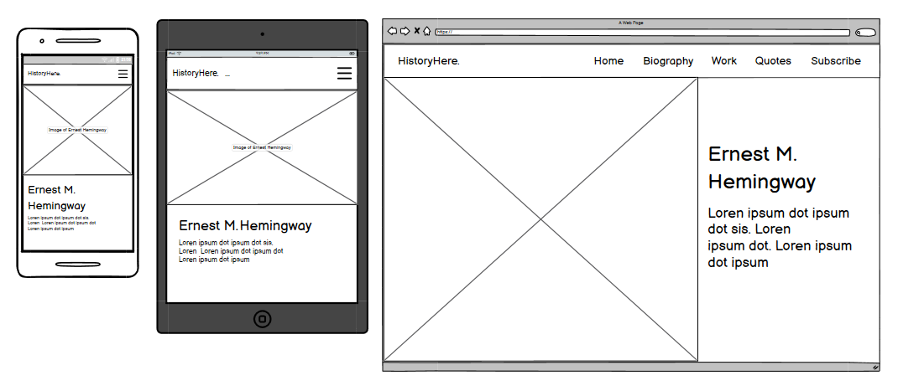
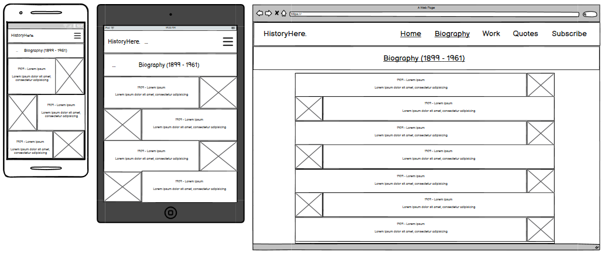
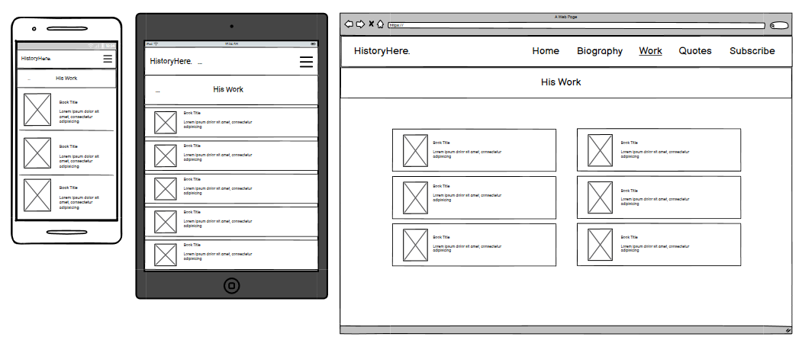
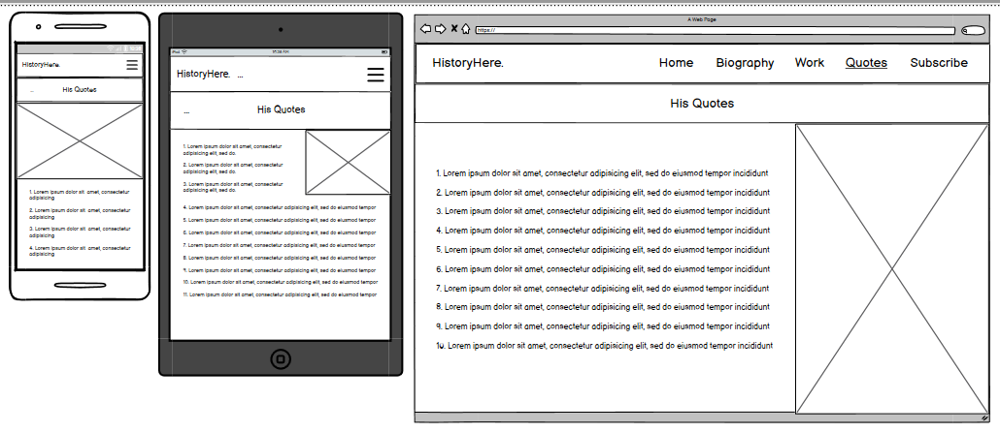
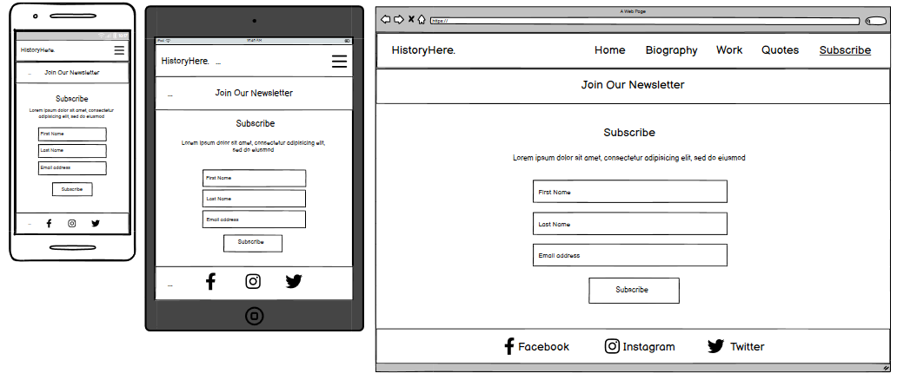

# The Life of Ernest Hemingway

View the live project [here](https://nataliiasolomchak21.github.io/the-life-of-ernest-hemingway/)

The Life of Ernest Hemingway is a website that includes evidence-based information about the life of one of the greatest authors of the 20th century. This website focuses on his professional life, so it will be handy to those who want to know about his books, quotes and overall journey to become one of the brightest minds of the last century.

## User Experience

### User Stories

#### First Time Visitor Goals

* I want to be able to navigate website easily using a navigational menu
* I want to see evidence-based information and high-quality images on the website
* I want to get a clear feedback to any of initiated actions

#### Frequent Visitor Goals

* I want to be able to use the website across all the devices
  
## Design Stage

### Wireframes

#### Home section

The idea was to have a landing page with hero image, a heading and a paragraph. The mobile and tablet versions would look almost identical with minor adjustments added such as different font-size and image size. For the laptop and desktop versions, the image and text content would be displayed side by side.

#### Header and Navbar menu

The navbar menu was hidden with hamburger icon until triggered for mobile and tablet screen sizes. The navbar was presented in its full width for laptops and desktops.

#### Biography section

The biography section contained a heading, text content and images that were presented in rows. The size of the text and images was changing depending on what type of screen size the user had. For mobile and tablet, it took all the width of the screen while for laptop and desktop, the content is centred.

#### Work section

The work section contained a heading, text content and images that were presented in a row and positioned to go one after other. The size of the text and images was changing depending on what type of screen size the user had. For mobile and tablet, it was presented in one column while for laptop and desktop, the content was put into two separate columns.

#### Quotes section

The quotes section contained a heading, text content and one image. The size of the text and image was changing depending on what type of screen size the user had. For mobile, the image took half the height of the screen. For tablet, it was positioned on the right side of the screen while for laptop and desktop, the all content took the same height of the screen size and was positioned side by side.

#### Subscribe section and Footer

The subscribe section contained a heading, text content and form that were presented in a column. The size of text content and form was changing depending on what type of screen size the user had. The main elements that were adjusted were the inputs and button. For the footer, the size of social-media icons was the only thing I had to adjust.
