# The Life of Ernest Hemingway

View the live project [here](https://nataliiasolomchak21.github.io/the-life-of-ernest-hemingway/)

The Life of Ernest Hemingway is a website that includes evidence-based information about the life of one of the greatest authors of the 20th century. This website focuses on his professional life, so it will be handy to those who want to know about his books, quotes and overall journey to become one of the brightest minds of the last century.

## User Experience

### User Stories

#### First Time Visitor Goals

* I want to be able to navigate website easily using a navigational menu
* I want to see evidence-based information and high-quality images on the website
* I want to get a clear feedback to any of initiated actions

#### Frequent Visitor Goals

* I want to be able to use the website across all the devices
  
## Design Stage

### Wireframes

#### Header and Navbar menu

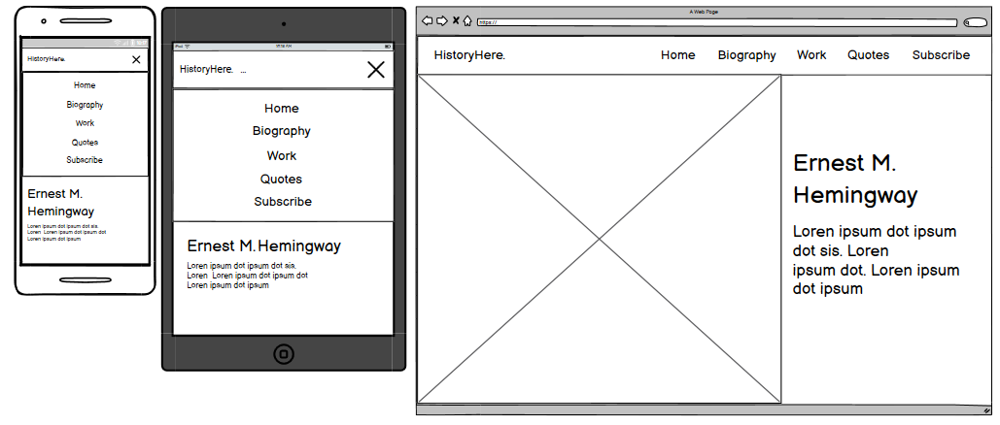

The navbar menu was hidden with hamburger icon until triggered for mobile and tablet screen sizes. The navbar was presented in its full width for laptops and desktops.

#### Home section

The idea was to have a landing page with hero image, a heading and a paragraph. The mobile and tablet versions would look almost identical with minor adjustments added such as different font-size and image size. For the laptop and desktop versions, the image and text content would be displayed side by side.

#### Biography section

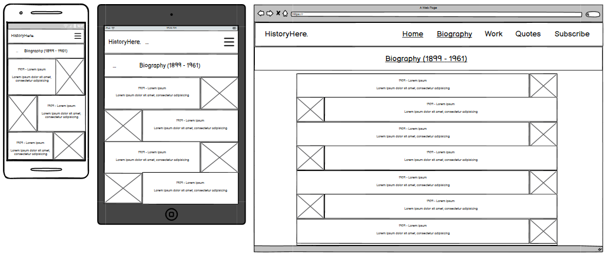

The biography section contained a heading, text content and images that were presented in rows. The size of the text and images was changing depending on what type of screen size the user had. For mobile and tablet, it took all the width of the screen while for laptop and desktop, the content is centred.

#### Work section

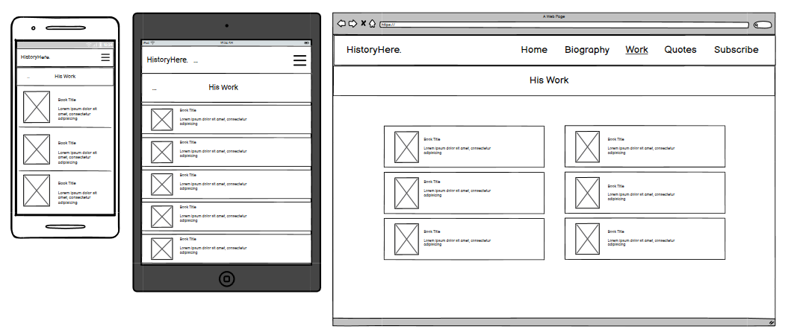

The work section contained a heading, text content and images that were presented in a row and positioned to go one after other. The size of the text and images was changing depending on what type of screen size the user had. For mobile and tablet, it was presented in one column while for laptop and desktop, the content was put into two separate columns.

#### Quotes section

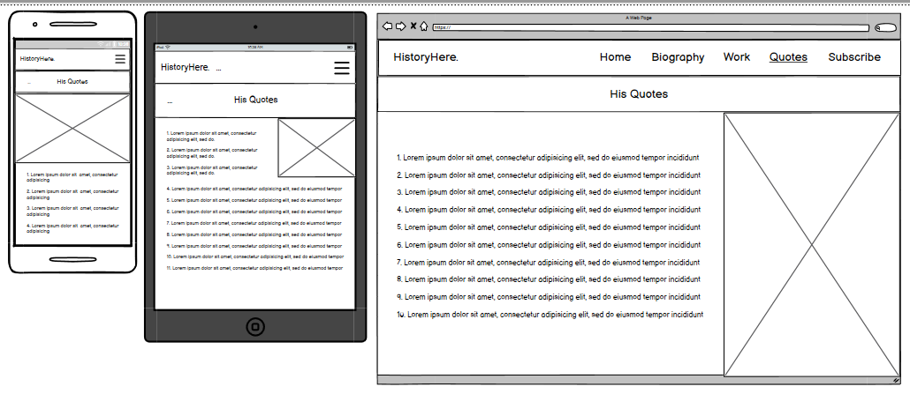

The quotes section contained a heading, text content and one image. The size of the text and image was changing depending on what type of screen size the user had. For mobile, the image took half the height of the screen. For tablet, it was positioned on the right side of the screen while for laptop and desktop, the all content took the same height of the screen size and was positioned side by side.

#### Subscribe section and Footer

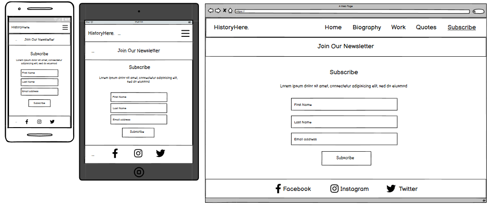

The subscribe section contained a heading, text content and form that were presented in a column. The size of text content and form was changing depending on what type of screen size the user had. The main elements that were adjusted were the inputs and button. For the footer, the size of social-media icons was the only thing I had to adjust.

### Color Palette

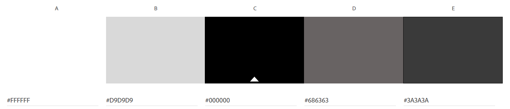

I chose these six colours because I thought that they suited the theme of my website as most of my images were in black and white. I also thought that they complement each other very well.

### Final Design

#### Mobile

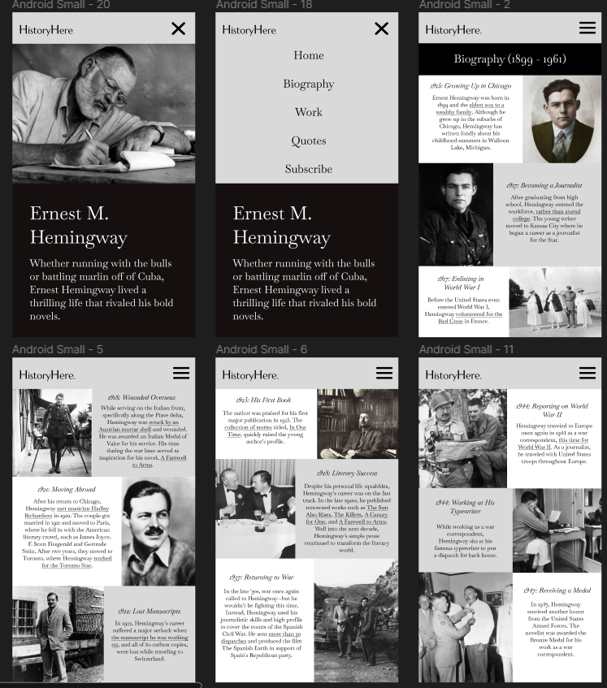
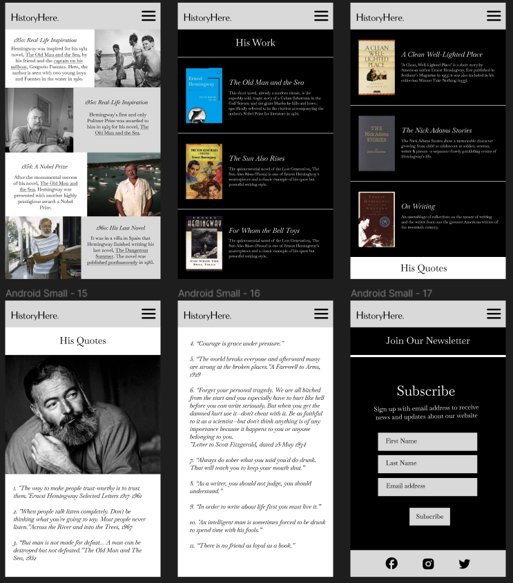

#### Tablet

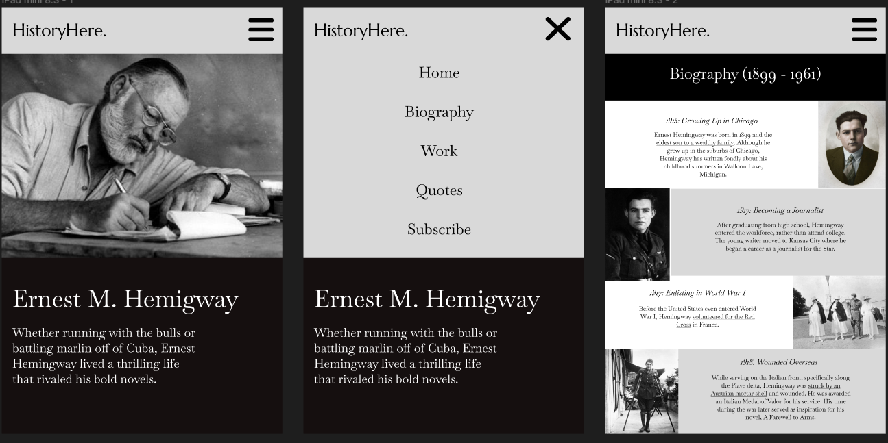
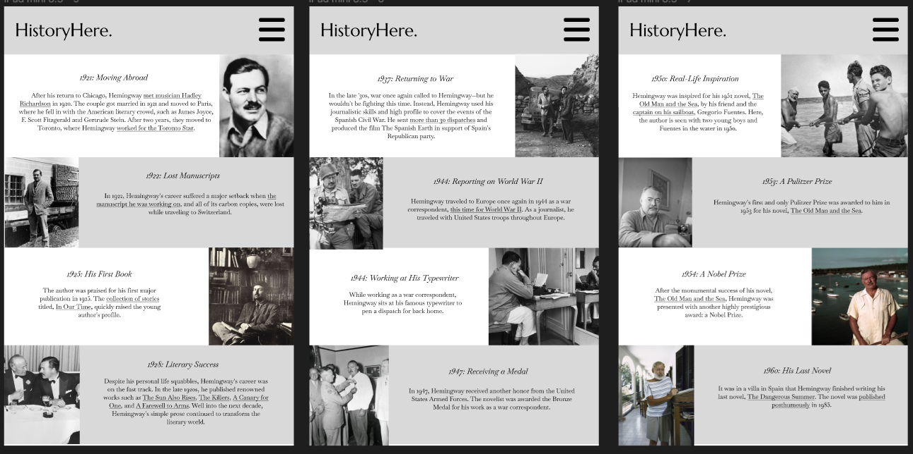
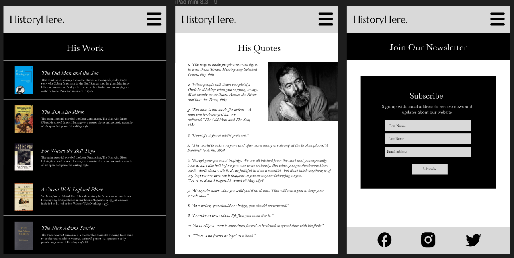

#### Desktop

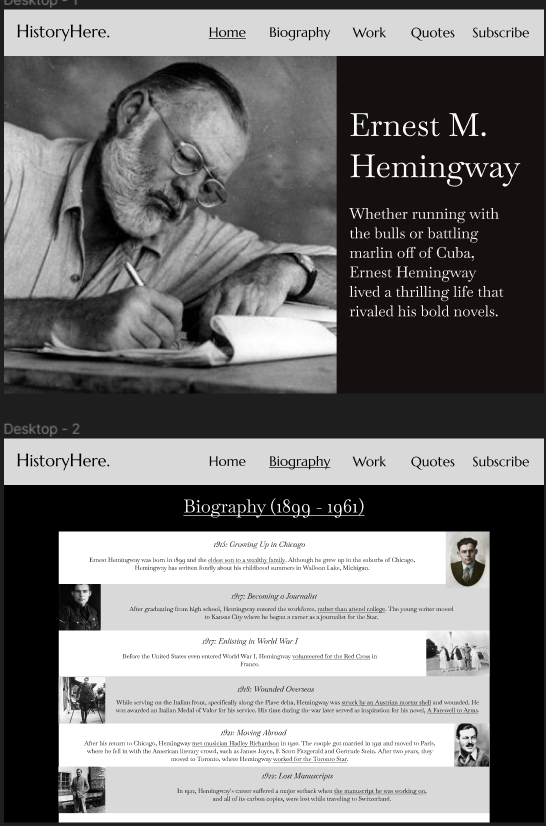
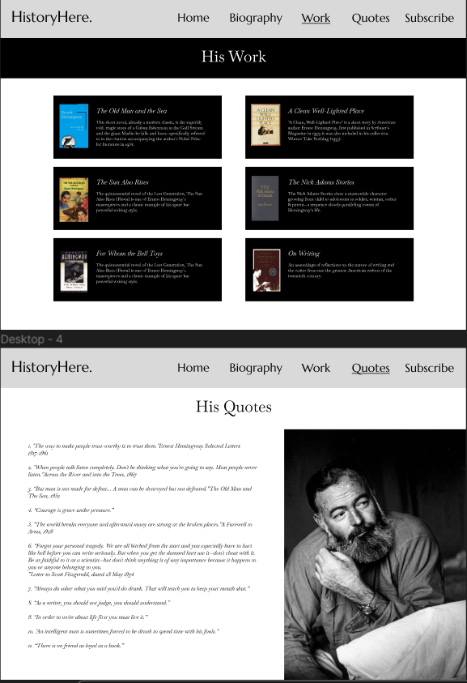
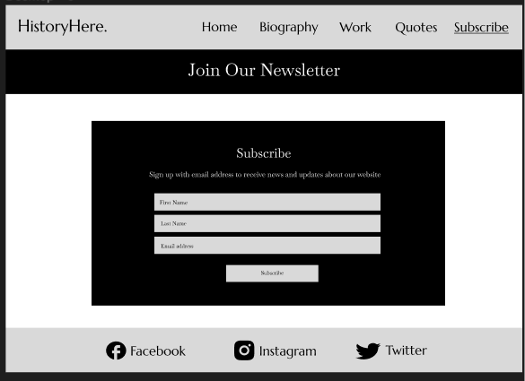

For the font, I used the Baskervville and Marcellus font families. The text was in black and white colours depending on what background colour the section had. All the sections had contrast between each other as well.

#### Things that were changed while developing the website

* The hero image on a landing page looks different in the deployed version as the first image that I used turned out to be very pixelated. It also has a lot more space around it in tablet and desktop versions.
* The images in the Biography section for desktop have some space around them for stylistic purpose.
* The work section for desktop no white background as there is no need to add that much negative space.
* The quotes section for tablet and desktop looks different as I decided to center the image.
* There is no white background in the subscribe section as I thought there is no need for contrast there.

## Features

### Existing Features

* __Navigational Bar__

  * Featured on top of the website, the full responsive navigation bar includes links to the HistoryHere Logo, Home, Biography, Work, Quotes and Subscribe sections.
  * This feature will allow user to easily navigate between the sections without the need to scroll up or down to get to a certain section.
  
  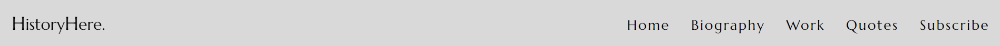   
  
* __Home section__

  * Being the first section of the website, the Home section contains hero-image, a h1 heading and a paragraph.
  * This feature will allow user to clearly understand the purpose of this website and who this website is about.
  
  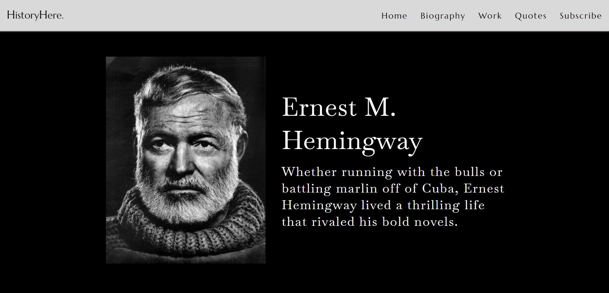
  
* __Biography section__

  * The Biography section contains a heading, and container with images and text being put side by side for pleasing visual appearnce.
  * This feature will allow user to learn interesting facts about the life of Ernest Hemingway and see rare pictures of him.
  
  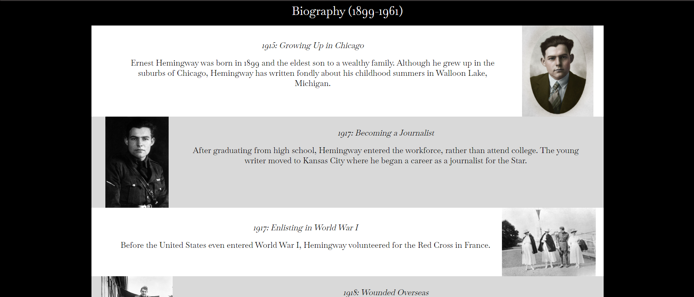
  
* __Work section__

  * The Work section contains some of the most popular Hemingway's books and a description of each of them.
  * This feature will allow user to learn about author's work and encourage them to choose a book to review.
  
  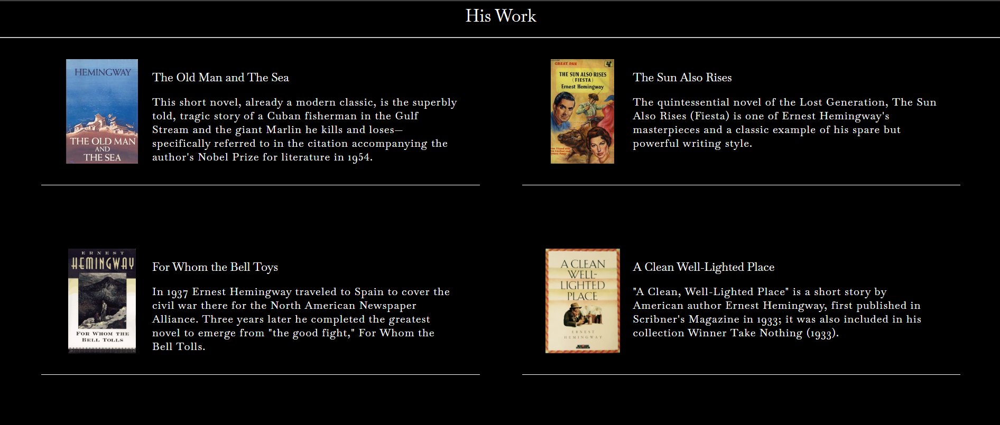
  
* __Quotes section__

  * The Quotes section contains another image of author and his quotes from some of his books and his own.
  * This feature will allow user to understand what kind of person he was how he viewed the world around him.
  
  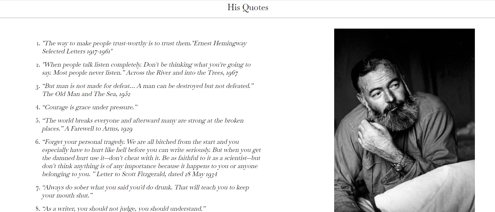

