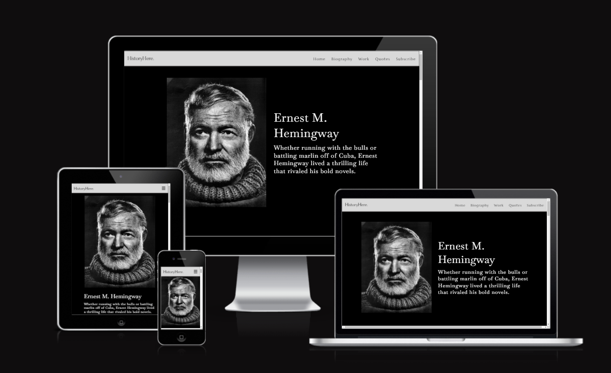
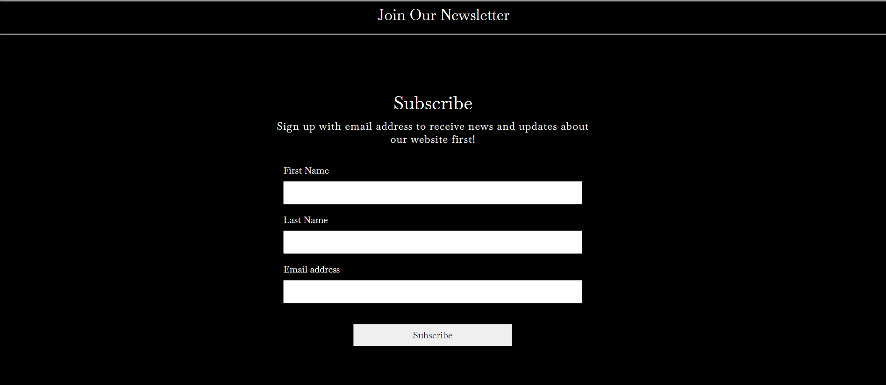
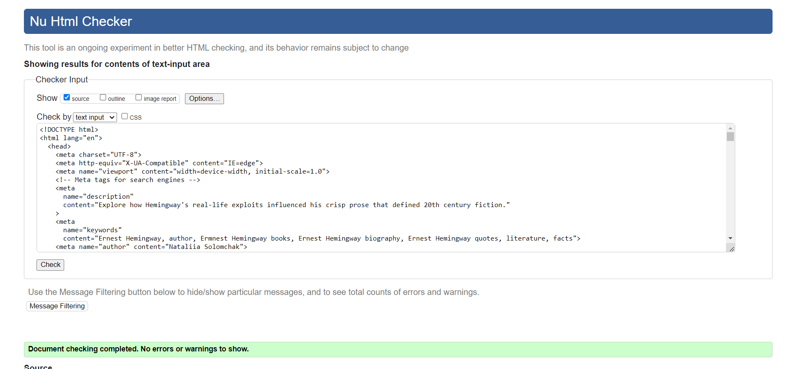
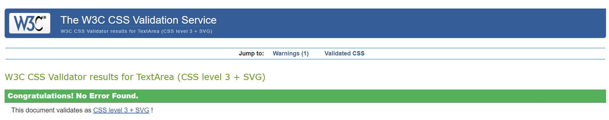
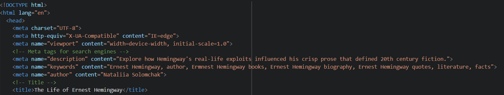
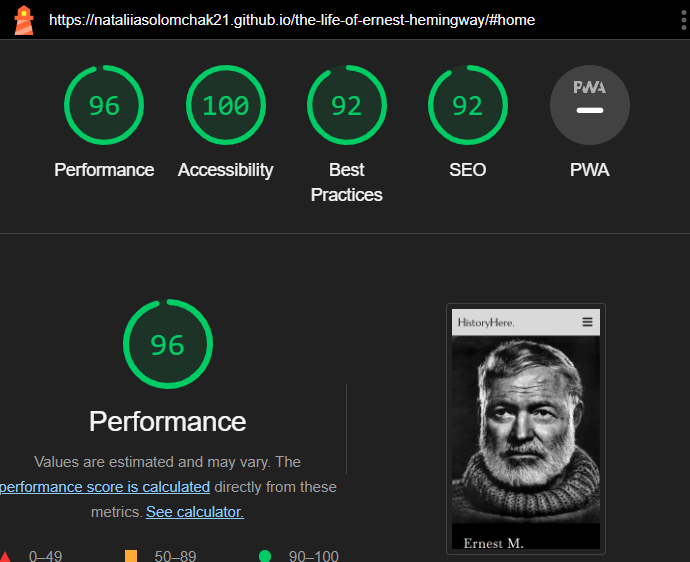
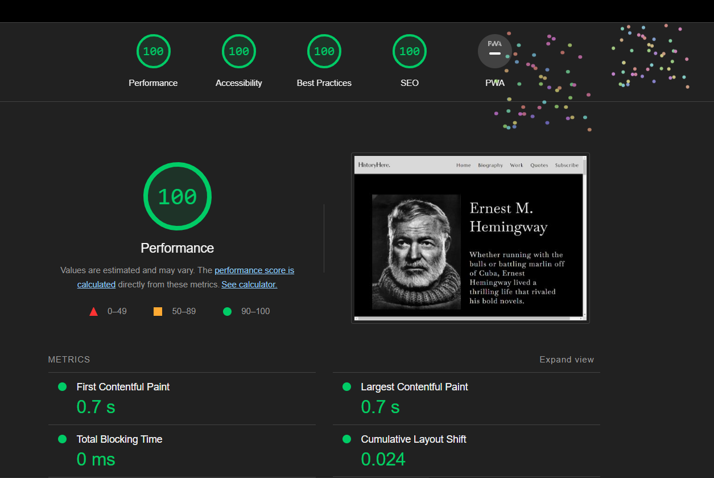
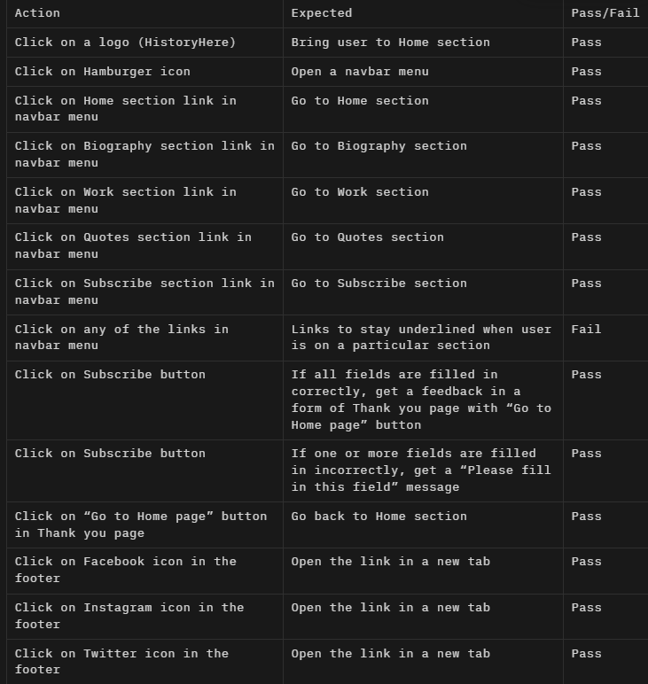

# The Life of Ernest Hemingway

View the live project [here](https://nataliiasolomchak21.github.io/the-life-of-ernest-hemingway/)

The Life of Ernest Hemingway is a single scrolling page website that includes evidence-based information about the life of one of the greatest authors of all time. This website focuses on his professional life, so it will be handy to those who want to know more about his books, quotes and overall journey to become one of the brightest minds of the last century.

## User Experience

### Target Audience

* Literature students - Those studying American literature could benefit from learning about Hemingway's major works amd place within literary history.
* Casual readers- Those generally interested in biographies, 20th century authors, or American historical figures.
* Hemingway enthusiasts - Those who have read his works and are interested in his life story.

### Key Project Goals

* Provide his biography with a focus on his professional life and his journey to become an author - Including major events, travels and accomplishements.
* Showcase his notable works - Include short descriptions of some of his most famous books.
* Cite inspirational quotes - Highlight memorable quotes that show his perspective on life.

### User Stories

#### First Time Visitor Goals

* I want to be able to navigate website easily using a navigational menu
* I want to see evidence-based information and high-quality images on the website
* I want to get a clear feedback to any of initiated actions

#### Frequent Visitor Goals

* I want to be able to use the website across all the devices
  
## Design Stage

### Wireframes

#### Header and Navbar menu

The navbar menu was hidden with hamburger icon until triggered for mobile and tablet screen sizes. The navbar was presented in its full width for laptops and desktops.

#### Home section

The idea was to have a landing page with hero image, a heading and a paragraph. The mobile and tablet versions would look almost identical with minor adjustments added such as different font-size and image size. For the laptop and desktop versions, the image and text content would be displayed side by side.

#### Biography section

The biography section contained a heading, text content and images that were presented in rows. The size of the text and images was changing depending on what type of screen size the user had. For mobile and tablet, it took all the width of the screen while for laptop and desktop, the content is centred.

#### Work section

The work section contained a heading, text content and images that were presented in a row and positioned to go one after other. The size of the text and images was changing depending on what type of screen size the user had. For mobile and tablet, it was presented in one column while for laptop and desktop, the content was put into two separate columns.

#### Quotes section

The quotes section contained a heading, text content and one image. The size of the text and image was changing depending on what type of screen size the user had. For mobile, the image took half the height of the screen. For tablet, it was positioned on the right side of the screen while for laptop and desktop, the all content took the same height of the screen size and was positioned side by side.

#### Subscribe section and Footer

The subscribe section contained a heading, text content and form that were presented in a column. The size of text content and form was changing depending on what type of screen size the user had. The main elements that were adjusted were the inputs and button. For the footer, the size of social-media icons was the only thing I had to adjust.

### Color Palette

I chose these six colours because I thought that they suited the theme of my website as most of my images were in black and white. I also thought that they complement each other very well.

### Final Design

#### Mobile (360x640)

#### Tablet (744x1133)

#### Desktop (1440x1024)

For the font, I used the Baskervville and Marcellus font families. The text was in black and white colours depending on what background colour the section had. All the sections had contrast between each other as well.

#### Things that were changed while developing the website

* The hero image on a landing page looks different in the deployed version as the first image that I used turned out to be very pixelated. It also has a lot more space around it in tablet and desktop versions.
* The images in the Biography section for desktop have some space around them for stylistic purpose.
* The work section for desktop no white background as there is no need to add that much negative space.
* The quotes section for tablet and desktop looks different as I decided to center the image.
* There is no white background in the subscribe section as I thought there is no need for contrast there.
* The footer doesn't have text next to the social media icons as I thought it was unnecessary to add it.

## Features

### Existing Features

* __Navigational Bar__

  * Featured on top of the website, the full responsive navigation bar includes links to the HistoryHere Logo, Home, Biography, Work, Quotes and Subscribe sections.
  * This feature will allow user to easily navigate between the sections without the need to scroll up or down to get to a certain section.
  
  
  
* __Home section__

  * Being the first section of the website, the Home section contains hero-image, a h1 heading and a paragraph.
  * This feature will allow user to clearly understand the purpose of this website and who this website is about.
  
  
  
* __Biography section__

  * The Biography section contains a heading, and container with images and text being put side by side for pleasing visual appearnce.
  * This feature will allow user to learn interesting facts about the life of Ernest Hemingway and see rare pictures of him.
  
  
  
* __Work section__

  * The Work section contains some of the most popular Hemingway's books and a description of each of them.
  * This feature will allow user to learn about author's work and encourage them to choose a book to review.
  
  
  
* __Quotes section__

  * The Quotes section contains another image of author and his quotes from some of his books and his own.
  * This feature will allow user to understand what kind of person he was how he viewed the world around him.
  
  

* __Subscribe section__

  * The Subscribe section contains a form that allow user to put in their name and email address receiving a clear feedback that their form has been submitted.
  * This feature will be valuable to user as it allows them to receive email messages about updates on the website.
  
  
  
* __Footer__

  * The footer allows user to visit social media pages, each opens in a separate page.
  
  

### Features Left to Implement

* Multimedia section that includes embedded videos/recordings of Hemingway and media adaptations of his work.
* Resources Section that list of books, biographies, scholars for learning more. Links to Hemingway Foundation, house tours, museum, etc.
* 404 page that will give clear feedback to user if any of the links don't work.

## Testing

### Validator Testing

#### HTML

* No errors were returned when passing through the official [W3C validation](https://validator.w3.org/)

#### CSS

* No errors were returned when passing through the official [(Jigsaw) validation](https://validator.w3.org/)

### Accessibility

In order to ensure that the webiste was accessible to all users the following was done:

* All images have clear alt attributes that explains what's each image is about
* Labels were put to all the inputs
* Aria-labels were added to all the external links to provide the purpose for them for screen readers

### SEO

Meta tags were put in a head of html file to tell the search engines and users more about the website and the information it contains.

### Lighthouse

Lighthouse(Chrome's developer tool) was used to check the performance of the website on mobile devices and desktops.

* Mobile

* Desktop
  

### Manual Testing

Manual testing was done on mobile device, tablet, laptop and desktop.

#### Screen sizes

The website works well and is responsive on the following mobile devices and tablets:

* Samsung Galaxy A51
* Samsung Galaxy A34
* OPPO A12
* Moto G Power
* iPhone XR
* iPhone 12 Pro
* Samsung Galaxy S8+
* Samsung Galaxy S20 Ultra
* iPad Air
* iPad Mini

### Browsers

The website works in the following browsers:

* Chrome
* Opera
* Microsoft Edge

In Firefox, the images in Home and Quotes sections are stretched. The images in Work section are smaller than they should be.

### Unfixed Bugs

* The links in navbar menu when clicked don't stay underlined when user is in particular section. I have tried different things to make them work but unfortunately I wasn't able to do that. I guess I need JavaScript for it.
* When you user clicks on "Go to Home page" button in Thank You page, it brings they back to index.html page but the header is hidden and doesn't have a fixed position. It all goes back to how it should be only when the page is refreshed. I couldn't find a reason to that as "Go to Home page" is correctly connected to index.html.

### Fixed Bugs

* I had a problem with h2 headings of my sections. They wouldn't show up once you clicked on the link in navbar menu. My groupmate Oleksiy Lazarenko helped with that by suggesting adding scroll-padding-top to the asterisk selector.

## Technologies Used

* [Figma](https://www.figma.com/) was used to create the final design of a website.
* [Font Awesome](https://fontawesome.com/) was used for social media icons in the footer.
* [Google Fonts](https://fonts.google.com/) was used to add specific font families to the stylesheet.
* [Adobe Color](https://color.adobe.com/create/color-wheel) was used to create a color palette.
* [Balsamiq](https://balsamiq.com/wireframes/?gad=1&gclid=EAIaIQobChMI0e6F_qbkgAMVBKnVCh1HRgnBEAAYASAAEgLVSvD_BwE) was used to create wireframes to show the initial layout of the website.
* [Codeanywhere](https://codeanywhere.com/solutions/collaborate) was used to code the website.
* [W3C validation](https://validator.w3.org/) was used to check the markup validity of html file.
* [(Jigsaw) validation](https://validator.w3.org/) was used to check the validity of css file.
* [Am I Responsive](https://ui.dev/amiresponsive) was used to get a screenshot of a final look of the website on various devices.
* [Github](https://github.com/) was used to store the code of the website.
* Chrome DevTools was used to check the responsiveness of the website as well debug it.
* Chrome's Developer Tool Lighthouse was used to check the performance of the website.

## Languages Used

* HTML5 was used to create the structure of the website.
* CSS3 was used to style the website.

## Deployment

### Github Pages

The project was deployed to Github Pages using the following steps:

   1. Log in to Github or sign up (if you don't have an account)
   2. Locate the repository for the project called 'the-life-of-ernest-hemingway'.
   3. Go to Settings page.
   4. Choose Pages in a navigational bar on the left-hand side.
   5. Under 'Build and deployment', you'll see 'Source'. Choose 'Deploy to Branch' from dropdwon menu. 
   6. Make sure that 'main' branch is selected and folder is set '/ (root)'. Click 'Save'.
   7. Refresh the page and you'll see the link to your website.
   8. Congratulations! Your website has been deployed.

### How to Fork the Github Repository

1. If you want to fork the repository log in to Github or create an account.
2. Locate to the repository for the project called 'the-life-of-ernest-hemingway'.
3. In the top right corner click on 'Fork' button. 
4. Now you have a copy of the original repository in your Github account.

### How to Clone the Github Repository

1. If you want to clone the repository log in to Github or create an account.
2. Go to the main page of the repository 'the-life-of-ernest-hemingway'.
3. Click on '<> Code' and copy the URL from HTTPS.
4. Open Git Bash.
5. Change your current working directory to the location where you want your clone to be made.
6. Type 'git clone' into your terminal window, paste the URL you copied earlier and press Enter to create youe local clone.

    