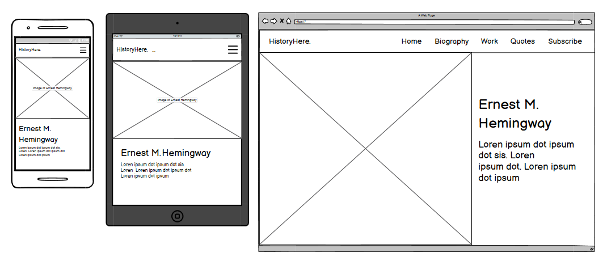

# The Life of Ernest Hemingway

View the live project [here](https://nataliiasolomchak21.github.io/the-life-of-ernest-hemingway/)

The Life of Ernest Hemingway is a website that includes evidence-based information about the life of one of the greatest authors of the 20th century. This website focuses on his professional life, so it will be handy to those who want to know about his books, quotes and overall journey to become one of the brightest minds of the last century.

## User Experience

### User Stories

#### First Time Visitor Goals

* I want to be able to navigate website easily using a navigational menu
* I want to see evidence-based information and high-quality images on the website
* I want to get a clear feedback to any of initiated actions

#### Frequent Visitor Goals

* I want to be able to use the website across all the devices
  
## Design Stage

### Wireframes

##### Home section

The idea was to have a landing page with hero image, a heading and a paragraph. The mobile and tablet versions would look almost identical with minor adjustments added such as diffrent font-size and image size. For the laptop and desktop version the image and text content would be displayed next to each other.
